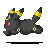

 <h1><b>
 <i>Oie, Bem Vindo(a) ao meu Perfil!</i>
  </b></h1>
  

 ###  <b>Estudando no Momento</b> 
 
  
 

 ##
  
 ###   <b>Linguagens e Ferramentas que mais uso</b>  
 
   
 
 
 
 
 
 
 
   
 ##

 ###  <b>Tenho Conhecimento Em</b> 
 <h4>Frameworks</h4>
 
 </a>

 <h4>Linguagens</h4>
 
 
 

 <h4>Bancos</h4>
 
 
 
 

<h4>IDEs</h4>

 ##

 ###  <b>Tenho Interesse Em</b> 
 
 
 
 
 
 
 
 

 ##
 
 ###  <b>Outras Redes Sociais</b> 
 
   
   
 ##

